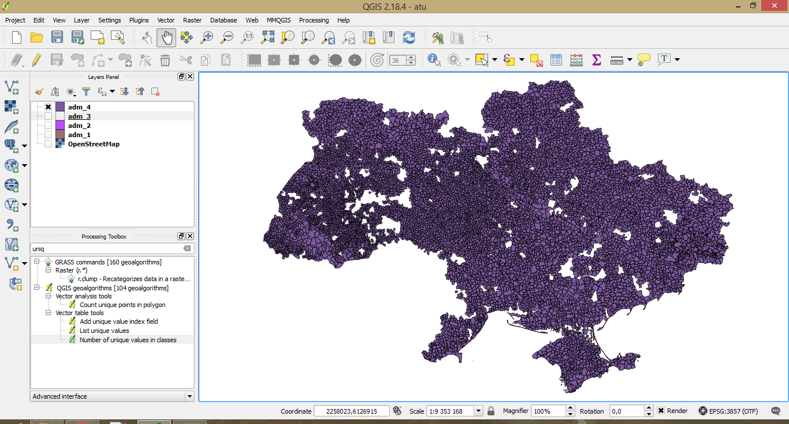
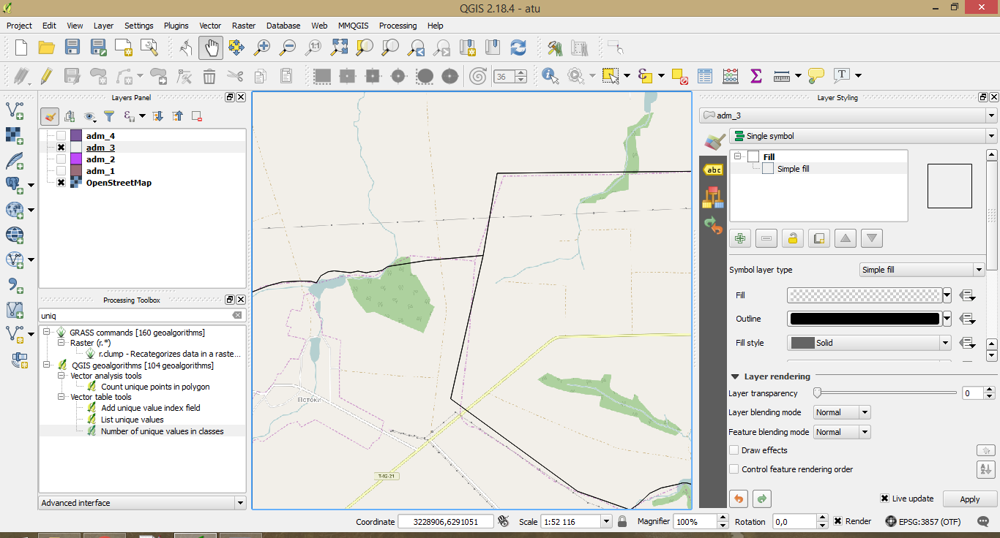

# atu_parser

[Геопортал адміністративно-територіального устрою (АТУ) України](http://atu.minregion.gov.ua/ua/karta) містить офіційну інформацію про межі кожного об'єкту АТУ.

Приклади формату збереження даних:

[Межі областей, районів, міст обласного значення, селищних раз, сільських рад](http://atu.minregion.gov.ua/api/format/region_template/ato.ato_level_territory_view/atoid/890/wkb_geometry,name_fullua,koatuu). Змінним елементом URL є код (у прикладі це число 890). Числа варіюються від 0 (Україна) до приблизно 12050. Також знайдено дані за кодами від 24050 до 24500. 

Приклад отриманих даних про сільські, селищні та міські ради: 

Приклад точності даних (межі адміністративних районів. Порівняння з OSM):

[Межі населених пунктів](http://atu.minregion.gov.ua/api/format/settlement_template/ato.ato_all_city/atoid/8870140596641528/wkb_geometry,nameua,parent_list,koatuu). Змінним елементом URL є число (у прикладі це число 8870140596641528). Варіації чисел досі не встановлені. 

[Межі територіальних громад](http://atu.minregion.gov.ua/api/format/gromad_template/ato.gromad_super_view/gid/9346875914853545/wkb_geometry,name_fullua). Змінним елементом URL є число (у прикладі це число 9346875914853545). Варіації чисел досі не встановлені. 

[Розроблений код](atu.py) посилає запит на сервер, читає результат, формує текстовий документ, використовуючи формат json. [Інший код](atu_geo.py) читає усі існуючі текстові файли та формує із них файл формату .geojson, що читається ГІС-інструментарієм. Разом з цим формується файл із кодами незнайдених об'єктів. Причиною відсутності даних по кожному окремому об'єкту може бути: 

1. Помилка відгуку сервера

2. Проблеми із Вашим підключенням до мережі Інтернет

3. Відсутність об'єкта у БД

Шляхом декількох ітерацій [коду](atu_rest.py) із файлом незнайдених об'єктів прогнозується знаходження всіх існуючих об'єктів у БД.
